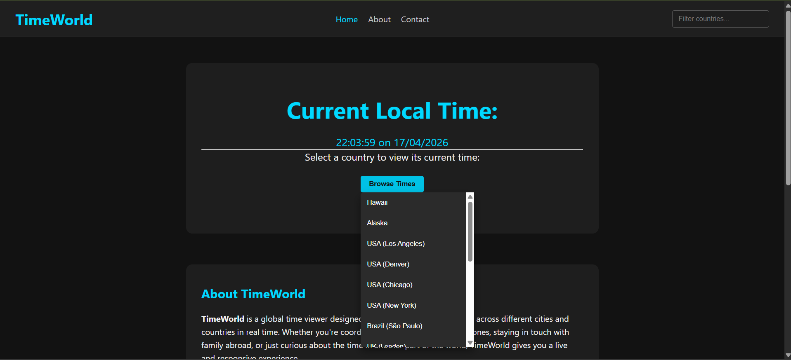
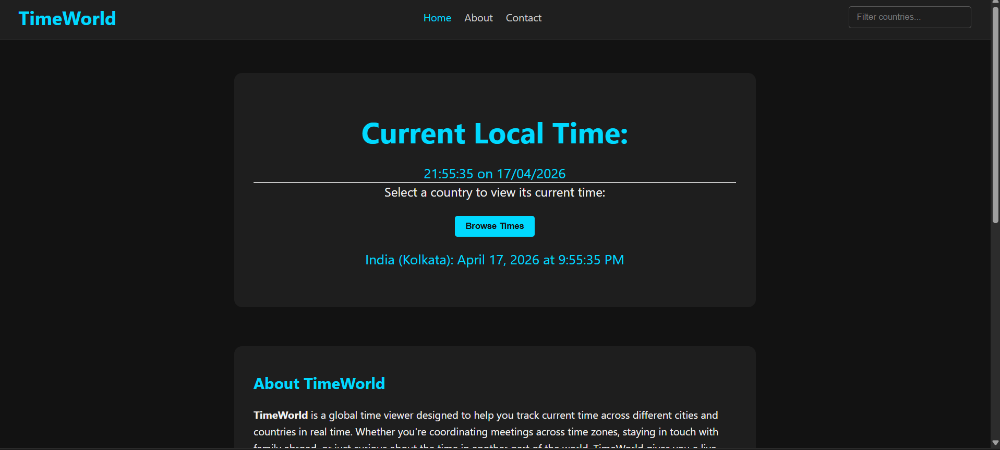

<div align="center">

#  TimeWorld

### Global Time Tracking • Real-Time Clock • Clean Interface

<p>
A web application that displays real-time current time across different regions, providing users with an intuitive way to track and compare global time zones.
</p>

<br/>

<a href="YOUR_LIVE_LINK_HERE" target="_blank">
  
</a>

<br/><br/>


</div>

---

## Overview

**TimeWorld** is a simple yet effective web application that allows users to view the current time across different countries and time zones.

The application dynamically fetches and updates time values, helping users stay synchronized with global time differences in a clean and minimal interface.

---

## Screenshots

<div align="center">

| Main Interface |
|----------------|
|  |
| Time Display |
|  |

</div>

---

## Explanation of UI

- **Main Interface**  
  Displays available regions or cities where users can check the current time.

- **Time Display Section**  
  Shows:
  - Current time  
  - Time zone information  
  - Real-time updates  

The UI is designed to be simple and focused, ensuring quick readability.

---

## Key Features

- Real-time clock updates  
- Multiple time zone support  
- Dynamic time fetching  
- Clean and responsive UI  
- Lightweight and fast performance  

---

## Technology Stack

<div align="center">

| Category | Technology |
|----------|-----------|
| Structure |  HTML |
| Styling |  CSS |
| Logic |  JavaScript |
| API |  Time API |

</div>

---

## Project Structure

```
07_TimeWorld/
├── index.html
├── style.css
├── script.js
├── assets/
│   ├── home.png
│   └── time.png
└── README.md
```

---

## How It Works

1. User opens the application  
2. JavaScript fetches current time data  
3. Data is processed and displayed  
4. Time updates dynamically in real-time  

---

## API Integration

```
GET http://worldtimeapi.org/api/timezone/{zone}
```

### Data Used

- Current datetime  
- Timezone  
- UTC offset  

---

## Getting Started

### Prerequisites

- Web browser  

---

### Installation

```bash
git clone https://github.com/priyanildz/TimeWorld.git
cd TimeWorld
```

---

## Run Project

Open:

```
index.html
```

in your browser

---

## Use Cases

- Tracking global time zones  
- Learning API integration  
- Understanding real-time updates in JavaScript  
- Lightweight utility tool  

---

## Future Improvements

- Add more cities dynamically  
- Time comparison feature  
- Dark mode  
- Better UI enhancements  

---

## License

This project is licensed under the MIT License.

---

<div align="center">

Developed by  
<strong>priyanildz</strong>

</div>